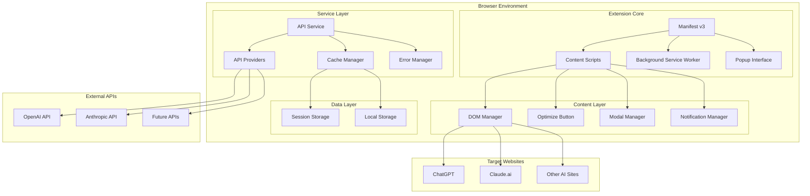
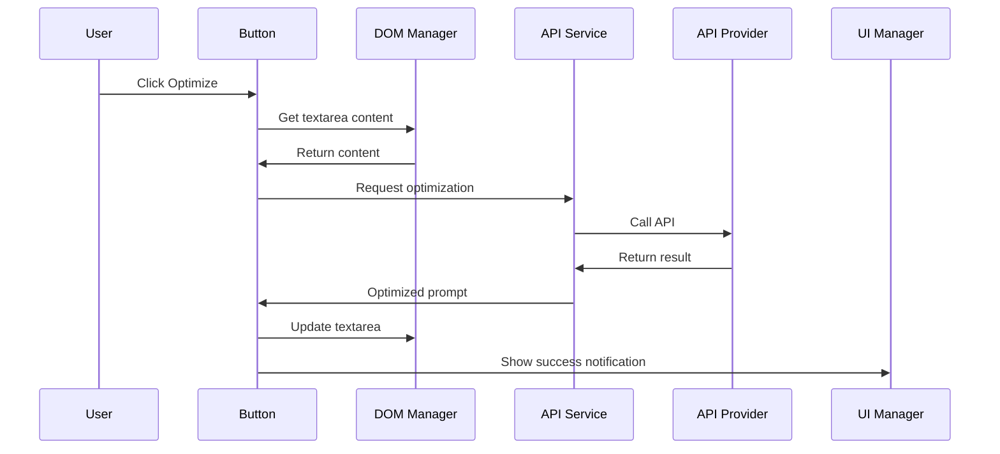
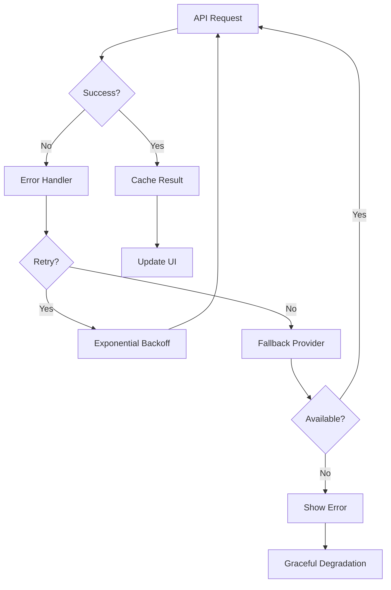

# 🏗️ System Architecture

> **Note**: This document provides the high-level architectural overview. For implementation details, see [Advanced Guide](ADVANCED.md) and [Getting Started](GETTING-STARTED.md).

## Overview
The AI Prompt Optimizer Chrome Extension follows a modular, event-driven architecture designed for scalability, maintainability, and cross-platform compatibility across multiple AI chat websites.

## Architecture Diagram



## Core Design Patterns

### 1. **Provider Pattern** 
*Enables pluggable API integrations*

The extension uses a provider pattern to support multiple AI APIs seamlessly:

```javascript
class APIProviders {
  constructor() {
    this.providers = new Map([
      ['openai', new OpenAIProvider],
      ['anthropic', new AnthropicProvider]
    ]);
  }
}
```

> **Implementation**: See [API Providers section](ADVANCED.md#adding-new-api-providers) in Advanced Guide

### 2. **Adapter Pattern**
*Handles different website structures*

Each AI chat website has unique DOM structures. The adapter pattern normalizes these differences:

```javascript
class WebsiteAdapter {
  static create(domain) {
    const adapters = {
      'chatgpt.com': ChatGPTAdapter,
      'claude.ai': ClaudeAdapter
    };
    return new (adapters[domain] || DefaultAdapter)();
  }
}
```

> **Adding new sites**: See [Adding New Websites](ADVANCED.md#adding-new-websites) guide

### 3. **Plugin System**
*Extensible architecture for future features*

```javascript
class PluginManager {
  constructor() {
    this.plugins = new Map();
  }
  
  async execute(hook, data) {
    for (const plugin of this.plugins.values()) {
      if (plugin[hook]) await plugin[hook](data);
    }
  }
}
```

## Data Flow Architecture

### User Interaction Flow


### Error Handling Flow


> **Error handling details**: See [Troubleshooting](ADVANCED.md#troubleshooting) section

## Performance Architecture

### Caching Strategy
The extension implements a multi-level caching system:

```javascript
class CacheManager {
  constructor() {
    this.promptCache = new LRUCache(100);      // Recent prompts
    this.responseCache = new TTLCache(3600);   // API responses (1 hour)
  }
}
```

### Memory Management
Automatic cleanup prevents memory leaks:

```javascript
class MemoryManager {
  static cleanup() {
    this.promptCache?.clear();
    this.eventListeners?.forEach(listener => {
      document.removeEventListener(listener.event, listener.handler);
    });
    this.controller?.abort();
  }
}
```

> **Performance optimization**: See [Performance Optimization](ADVANCED.md#performance-optimization) section

## Security Architecture

### Multi-layered Security Approach

1. **Input Sanitization**
   ```javascript
   class InputSanitizer {
     static sanitize(input) {
       return input
         .replace(/<script[^>]*>.*?<\/script>/gi, '')
         .replace(/javascript:/gi, '')
         .trim()
         .substring(0, 10000);
     }
   }
   ```

2. **Secure Storage**
   - API keys encrypted in session storage
   - No persistent storage of sensitive data
   - CSP headers prevent XSS attacks

3. **Minimal Permissions**
   - Only requests necessary browser permissions
   - Scoped to specific websites

> **Security details**: See [Security Considerations](ADVANCED.md#security-considerations)

## Testing Architecture

### Testing Pyramid
```
tests/
├── unit/                    # Fast, isolated tests
│   ├── api-service.test.js
│   ├── dom-manager.test.js
│   └── cache-manager.test.js
├── integration/             # Component interaction tests
│   ├── website-integration.test.js
│   └── api-integration.test.js
└── e2e/                     # Full user journey tests
    ├── user-flow.test.js
    └── cross-browser.test.js
```

### Mock Strategy
```javascript
class MockFactory {
  static createAPIResponse(provider, success = true) {
    const responses = {
      openai: { choices: [{ message: { content: 'optimized' } }] },
      anthropic: { content: [{ text: 'optimized' }] }
    };
    return success ? responses[provider] : new Error('API Error');
  }
}
```

> **Testing guide**: See [Testing](ADVANCED.md#testing) section

## Monitoring & Observability

### Error Tracking
```javascript
class ErrorTracker {
  static track(error, context) {
    const errorData = {
      message: error.message,
      stack: error.stack,
      context,
      timestamp: Date.now(),
      version: chrome.runtime.getManifest().version
    };
    
    console.error('[AI Optimizer Error]', errorData);
  }
}
```

### Performance Monitoring
```javascript
class PerformanceTracker {
  static measure(operation, fn) {
    const start = performance.now();
    const result = fn();
    const duration = performance.now() - start;
    console.log(`[Performance] ${operation}: ${duration}ms`);
    return result;
  }
}
```

> **Monitoring setup**: See [Analytics & Monitoring](ADVANCED.md#analytics--monitoring)

## Deployment Architecture

### Build Pipeline
- **Development**: Hot reload, debug mode, verbose logging
- **Production**: Minified, optimized, error reporting

### Environment Configuration
```javascript
const config = {
  development: {
    apiTimeout: 60000,
    debug: true,
    cache: false
  },
  production: {
    apiTimeout: 30000,
    debug: false,
    cache: true
  }
};
```

> **Deployment guide**: See [Deployment](ADVANCED.md#deployment) section

## Future Architecture Considerations

### Planned Enhancements
1. **Multi-Browser Support**
   - Firefox WebExtensions API
   - Safari App Extensions
   - Edge Extensions

2. **Cloud Integration**
   - User account sync
   - Cloud-based optimization
   - Cross-device prompt history

3. **Advanced Features**
   - Custom prompt templates
   - Team collaboration features
   - Analytics dashboard

## Architecture Benefits

### ✅ **Modularity**
- Single responsibility principle
- Easy to test individual components
- Pluggable architecture for extensions

### ✅ **Scalability** 
- Provider pattern enables easy API additions
- Adapter pattern supports new websites
- Cache architecture handles growing usage

### ✅ **Reliability**
- Comprehensive error handling with fallbacks
- Graceful degradation when services fail
- Automatic retry mechanisms

### ✅ **Performance**
- Lazy loading reduces initial load time
- Multi-level caching minimizes API calls
- Debounced operations prevent spam requests

### ✅ **Security**
- Input sanitization prevents injection attacks
- Secure storage for sensitive data
- Minimal permissions model

## Quick Links

- **🚀 [Getting Started](GETTING-STARTED.md)** - Installation and first use
- **🔧 [Advanced Guide](ADVANCED.md)** - Detailed implementation and customization
- **📊 [API Reference](ADVANCED.md#api-reference)** - Complete API documentation
- **🧪 [Testing Guide](ADVANCED.md#testing)** - How to test the extension
- **🚀 [Deployment](ADVANCED.md#deployment)** - Build and release process

---

*This architecture provides a solid foundation for the AI Prompt Optimizer extension while maintaining flexibility for future enhancements and scaling.*
