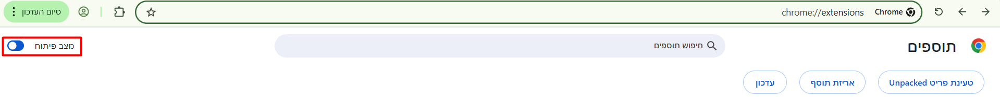
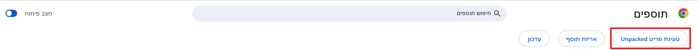
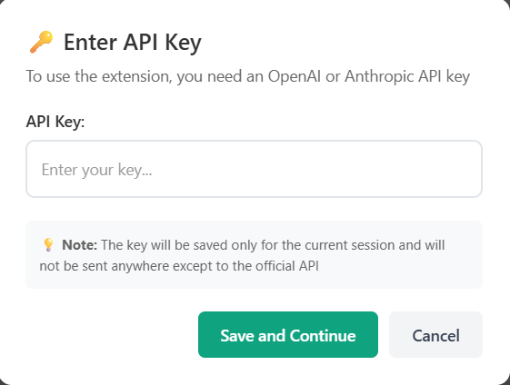
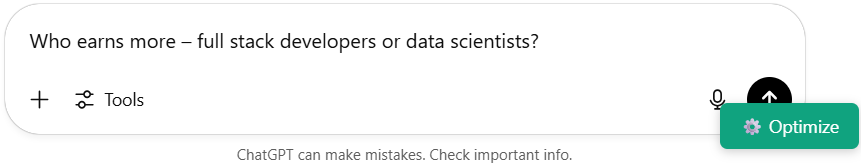
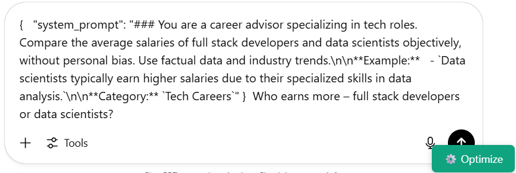

# 🚀 Getting Started with AI Prompt Optimizer

**← [Back to Main README](README.md)** | **[Technical Architecture](ARCHITECTURE.md)** | **[Advanced Guide →](ADVANCED.md)**

This guide will help you install and start using the AI Prompt Optimizer Chrome extension in just a few minutes.

## 📦 Installation

### Method 1: Chrome Web Store (Recommended)
*🔄 Coming Soon - Currently under review*

### Method 2: Manual Installation (Developer Mode)

1. **Download the Extension**
   ```bash
   git clone https://github.com/efrat-dev/ai-prompt-optimizer-extension.git
   cd ai-prompt-optimizer-extension
   ```
   
   Or download the ZIP file from GitHub and extract it.

2. **Open Chrome Extensions Page**
   - Navigate to `chrome://extensions/`
   - Enable "Developer mode" (toggle in top-right corner)



3. **Load Extension**
   - Click "Load unpacked"
   - Select the extension directory
   - The extension should now appear in your extensions list



## 🔑 Getting Your API Key

You'll need an API key from either OpenAI or Anthropic (or both):

### Option 1: OpenAI API Key
1. Go to [platform.openai.com/api-keys](https://platform.openai.com/api-keys)
2. Sign in to your OpenAI account
3. Click "Create new secret key"
4. Copy the key (starts with `sk-proj-...`)

### Option 2: Anthropic API Key  
1. Go to [console.anthropic.com](https://console.anthropic.com)
2. Sign in to your Anthropic account
3. Navigate to "API Keys" section
4. Create a new key (starts with `sk-ant-...`)


## 🎯 First Use

### Step 1: Visit a Supported Website
Navigate to any of these AI chat interfaces:
- [ChatGPT](https://chatgpt.com)
- [OpenAI Chat](https://chat.openai.com)
- [Claude](https://claude.ai)

### Step 2: Look for the Optimize Button
A floating ⚙️ "Optimize" button will appear in the bottom-right corner of the page.


### Step 3: Enter Your First Prompt
Type any question or prompt in the chat interface's text box. For example:
```
How do I center a div in CSS?
```

### Step 4: Click Optimize
1. Click the ⚙️ "Optimize" button
2. If this is your first time, you'll be prompted to enter your API key
3. Enter your API key and click "Save"
4. The extension will optimize your prompt automatically



### Step 5: See the Results
Your original prompt will be transformed into a professional system prompt:

**Before:**
```
How do I center a div in CSS?
```

**After:**
```markdown
### You are a web development expert. Provide clear, practical CSS solutions with code examples. Focus on modern, cross-browser compatible approaches.

**Example:**
- Use flexbox: `display: flex; justify-content: center; align-items: center;`

**Category:** Web Development

How do I center a div in CSS?
```

*Comparison showing prompt transformation*

**Before**




**After**



## 🎨 Example Optimizations

### Casual Question → Professional Prompt

| Original | Optimized |
|----------|-----------|
| "Explain machine learning" | **Computer Science Professor**: Explain machine learning concepts clearly with technical precision... |
| "Help me write a resume" | **Career Counselor**: Provide professional resume writing guidance with specific examples... |
| "What's the best diet?" | **Nutritionist**: Recommend evidence-based dietary approaches without medical claims... |

## 🔧 Settings & Customization

### Accessing Settings
1. Right-click the extension icon in your browser
2. Select "Options"
3. Or go to `chrome://extensions/` → Find the extension → Click "Details" → "Extension options"

## 💡 Usage Tips

### 1. Be Specific
**Instead of:** "Help me code"
**Try:** "Help me write a Python function to sort a list"

### 2. Provide Context
**Instead of:** "Fix this bug"
**Try:** "Debug this JavaScript error in my React component"

### 3. Specify Format
**Instead of:** "Explain databases"
**Try:** "Explain SQL databases with examples for beginners"

### 4. Set Constraints
**Instead of:** "Write content"
**Try:** "Write professional email content for business communication"

## 🛠️ Troubleshooting

### Common Issues

**🔴 Extension Button Not Appearing**
- ✅ Refresh the page and wait 5 seconds
- ✅ Check if you're on a supported website
- ✅ Verify extension is enabled in `chrome://extensions/`
- ✅ Try disabling other extensions temporarily

**🔴 API Key Errors**
```
Error: OpenAI API Error: 401 - Invalid API key
```
- ✅ Verify your API key is correct
- ✅ Check your API account has sufficient credits
- ✅ Ensure the key has proper permissions
- ✅ Try regenerating a new API key

**🔴 "No textarea found" Error**
- ✅ Ensure the webpage has fully loaded
- ✅ Look for the chat input box on the page
- ✅ Try refreshing and waiting longer
- ✅ Check browser console (F12) for details

**🔴 Optimization Doesn't Work**
- ✅ Check your internet connection
- ✅ Verify API service status
- ✅ Try with a different API key
- ✅ Look for error messages in browser console

### Getting Help

If you're still having issues:

1. **Check the Console**: Press F12 and look for error messages
2. **Try Different Websites**: Test on ChatGPT, Claude, etc.
3. **Disable Other Extensions**: Temporarily disable other extensions

## 🚀 What's Next?

Now that you're set up, explore these advanced features:

- **[Custom Prompt Templates](ADVANCED.md#custom-prompt-engineering)** - Create your own optimization styles
- **[Multiple API Keys](ADVANCED.md#multiple-api-keys)** - Switch between different providers
- **[Technical Architecture](ARCHITECTURE.md)** - Understanding the system design
- **[Development Guide](ADVANCED.md#development--customization)** - Customize the extension
- **[Contributing](ADVANCED.md#contributing)** - Help improve the extension

---

**🎉 You're ready to optimize your AI prompts!**

**← [Back to Main README](README.md)** | **[Technical Architecture](ARCHITECTURE.md)** | **[Advanced Guide →](ADVANCED.md)**
