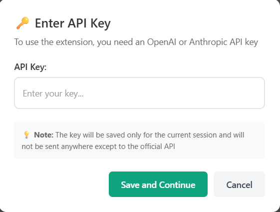
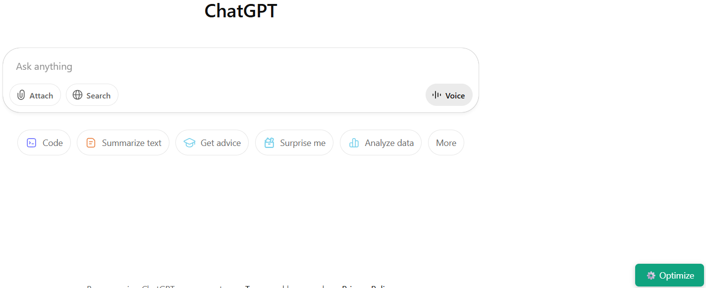

# 🚀 AI Prompt Optimizer Chrome Extension

[](https://github.com/your-username/ai-prompt-optimizer-extension)
[](LICENSE)
[](#)

Transform your casual AI prompts into professional, domain-specific system prompts for better AI responses.

## 📖 Documentation

- **[Installation & Quick Start](GETTING-STARTED.md)** - Setup guide and basic usage
- **[Advanced Usage & Development](ADVANCED.md)** - Customization, development, and troubleshooting
- **[Technical Architecture](ARCHITECTURE.md)** - Understanding the system design

## 🎯 What It Does

The AI Prompt Optimizer intelligently enhances your prompts before sending them to AI chat interfaces like ChatGPT and Claude. It adds a floating optimize button to supported AI websites, transforming casual questions into professional, structured prompts.

### Before Optimization
```
Explain recursion
```

### After Optimization
```markdown
### You are a computer science teaching assistant. Explain recursion clearly and professionally, without creative or humorous examples. Use precise terminology.

**Example:**
- Recursion is when a function calls itself to solve smaller instances of a problem.

**Category:** Technical Instruction

Explain recursion
```

## 🎥 Screenshots & Demo

### Extension in Action
*The floating optimize button appears on supported AI chat websites*


*Secure API key entry modal*



*Comparison showing prompt transformation*

**Before**


**After**


### Supported Websites
| Website | Status | Screenshot |
|---------|--------|------------|
| ChatGPT | ✅ Supported |  |
| OpenAI Chat (without registration) | ✅ Supported |  |
| Claude | ✅ Supported |  |

## ✨ Key Features

- **🌐 Universal Compatibility**: Works with ChatGPT & Claude
- **🧠 Smart Prompt Engineering**: Transforms casual questions into structured, professional prompts
- **⚙️ Floating Optimize Button**: Convenient button appears on supported websites
- **🔑 Dual API Support**: Compatible with both OpenAI and Anthropic APIs
- **🤖 Automatic API Detection**: Intelligently detects which API to use based on key format
- **🔒 Session-Based Storage**: API keys stored securely for current session only
- **🎨 Beautiful Notifications**: Elegant toast notifications for user feedback
- **⚡ Custom System Prompts**: Support for custom prompt templates

## 🚀 Quick Install

### Chrome Web Store (Recommended)
*Coming Soon - Pending Review*

### Manual Installation
1. Download or clone this repository
2. Open `chrome://extensions/` in Chrome
3. Enable "Developer mode"
4. Click "Load unpacked" and select the extension folder

**👉 [Complete Installation Guide](GETTING-STARTED.md)**

## 🎯 Supported Websites

- ✅ [ChatGPT](https://chatgpt.com)
- ✅ [OpenAI Chat](https://chat.openai.com)  
- ✅ [Claude](https://claude.ai)

## 🔧 Quick Setup

1. **Get an API Key**:
   - [OpenAI API Key](https://platform.openai.com/api-keys) 
   - [Anthropic API Key](https://console.anthropic.com)

2. **Visit a Supported Website**: Go to ChatGPT, Claude, etc.

3. **Click the ⚙️ Button**: Enter your API key when prompted

4. **Start Optimizing**: Type your prompt and click optimize!

## 🛠️ For Developers

### Project Structure
```
ai-prompt-optimizer-extension/
├── manifest.json              # Extension configuration
├── README.md                 # This file
├── GETTING-STARTED.md        # Installation & usage guide
├── ADVANCED.md               # Development & customization
├── prompt.md                 # System prompt template
├── js/                       # Core JavaScript files
├── css/                      # Styling
├── templates/               # HTML templates  
├── screenshots/             # Documentation images
└── assets/                  # Icons and resources
```

### Contributing
We welcome contributions! Please read our [development guide](ADVANCED.md#development--customization) for details on:
- Setting up the development environment
- Adding new features
- Customizing for different AI websites
- Submitting pull requests

## 🔐 Privacy & Security

- **No Data Collection**: We don't collect, store, or transmit your personal data
- **Session-Only Storage**: API keys stored only for current browser session
- **Direct API Calls**: Communicates only with official OpenAI/Anthropic endpoints
- **Local Processing**: All optimization happens in your browser

## 📄 License

MIT License - see [LICENSE](LICENSE) file for details.

---

*If you find this extension helpful, please ⭐ star this repository and share it with others!*
