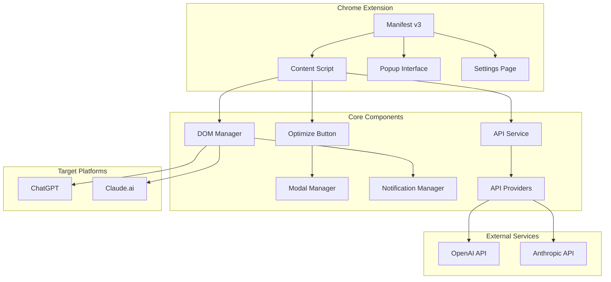
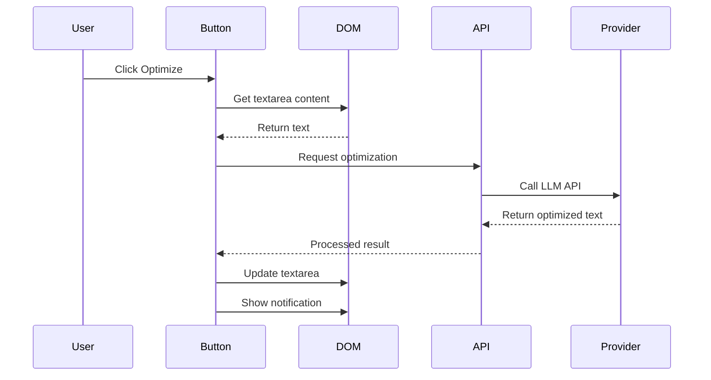
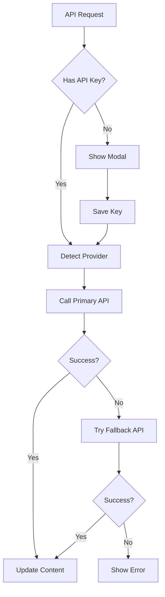

# 🏗️ System Architecture

> **Clean, focused architecture for AI prompt optimization across multiple chat platforms**

## Overview
The AI Prompt Optimizer Chrome Extension implements a lightweight, modular architecture designed for reliable prompt enhancement across ChatGPT, Claude, and other AI chat platforms. The system prioritizes simplicity, performance, and maintainability.

## Architecture Diagram



## Core Components

### 1. **Content Script** (`content.js`)
The main entry point that initializes the extension on AI chat websites:

```javascript
const domManager = new DOMManager();
const apiService = new APIService();
const optimizeButton = new OptimizeButton(domManager, apiService);
```

**Key Features:**
- Loads on target websites only
- Implements retry logic for button placement
- Monitors DOM changes for dynamic content
- Handles component lifecycle management

### 2. **DOM Manager** (`dom-manager.js`)
Handles all DOM interactions and UI feedback:

```javascript
class DOMManager {
  findTextareaAndContainer() {
    // Multi-selector approach for different platforms
    for (const selector of this.textareaSelectors) {
      // Platform-agnostic textarea detection
    }
  }
}
```

**Responsibilities:**
- Cross-platform textarea detection
- Content manipulation (get/set)
- Notification management
- Event handling

### 3. **API Service** (`api-service.js`)
Manages API communications and provider selection:

```javascript
class APIService {
  detectApiProvider(apiKey) {
    return apiKey.startsWith('sk-ant-') ? 'anthropic' : 'openai';
  }
  
  async optimizePrompt(input) {
    // Auto-detection with fallback logic
  }
}
```

**Features:**
- Automatic API provider detection
- Fallback mechanism between providers
- Secure key management
- Error handling with retry logic

### 4. **Optimize Button** (`optimize-button.js`)
The main user interface component:

```javascript
class OptimizeButton {
  async handleOptimizeClick(button) {
    // Loading state management
    // API key validation
    // Content optimization
    // UI feedback
  }
}
```

**Capabilities:**
- Fixed positioning with responsive design
- Loading states and visual feedback
- Error handling with modal integration
- Content concatenation (optimized + original)

### 5. **Modal Manager** (`modal-manager.js`)
Handles API key input when needed:

```javascript
class ModalManager {
  async showApiKeyModal() {
    // Dynamic HTML template loading
    // Event listener setup
    // Promise-based user interaction
  }
}
```

**Features:**
- Template-based modal rendering
- Keyboard navigation support
- Input validation
- Accessible design

### 6. **Notification Manager** (`notification-manager.js`)
Provides user feedback across the application:

```javascript
class NotificationManager {
  showNotification(message, type = 'success', duration = 3000) {
    // CSS injection
    // Stacked notifications
    // Auto-dismiss functionality
  }
}
```

**Notification Types:**
- Success (green) - Operation completed
- Error (red) - API or validation errors
- Warning (yellow) - Missing configuration
- Info (blue) - General information

## Data Flow

### User Interaction Flow


### Error Handling Flow


## Key Design Patterns

### 1. **Provider Pattern**
Enables support for multiple AI APIs:

```javascript
class APIProviders {
  static async optimizePromptWithOpenAI(apiKey, systemPrompt, input) {
    // OpenAI-specific implementation
  }
  
  static async optimizePromptWithAnthropic(apiKey, systemPrompt, input) {
    // Anthropic-specific implementation
  }
}
```

### 2. **Adapter Pattern**
Handles different website structures:

```javascript
this.textareaSelectors = [
  'textarea[data-id="root"]',           // ChatGPT
  'textarea[placeholder*="Message"]',    // Generic
  'div[contenteditable="true"]',        // Rich text editors
  'textarea'                            // Fallback
];
```

### 3. **Template Pattern**
Modal rendering with external HTML:

```javascript
const templateUrl = chrome.runtime.getURL('templates/modal-template.html');
const response = await fetch(templateUrl);
const htmlContent = await response.text();
```

## Security Implementation

### Input Sanitization
```javascript
// Automatic content length limiting
const input = this.domManager.getTextareaContent(textarea);
if (!input.trim()) {
  alert("Please enter text to optimize");
  return;
}
```

### Secure Storage
- API keys stored in Chrome's local storage
- No persistent sensitive data
- Session-based key management

### Minimal Permissions
```json
{
  "permissions": ["storage", "scripting", "activeTab"],
  "host_permissions": [
    "https://chat.openai.com/*",
    "https://api.openai.com/*"
  ]
}
```

## Performance Optimizations

### Lazy Loading
```javascript
// Dynamic imports for better performance
const { DOMManager } = await import('./dom-manager.js');
const { OptimizeButton } = await import('./optimize-button.js');
```

### Efficient DOM Monitoring
```javascript
const observer = new MutationObserver(() => {
  if (!document.querySelector('#gpt-optimize-btn')) {
    setTimeout(tryAddButton, 1000);
  }
});
```

### CSS Injection Optimization
```javascript
injectCSS() {
  if (this.cssInjected) return;
  // One-time CSS injection
  this.cssInjected = true;
}
```

## File Structure

```
├── manifest.json              # Extension configuration
├── popup.html                 # Extension popup interface
├── settings.html              # Settings page
├── templates/
│   └── modal-template.html    # API key modal template
├── css/
│   ├── modal-styles.css       # Modal styling
│   └── notifications.css      # Notification styling
├── js/
│   ├── content.js            # Main content script
│   ├── dom-manager.js        # DOM manipulation
│   ├── api-service.js        # API communication
│   ├── optimize-button.js    # Main UI component
│   ├── modal-manager.js      # Modal handling
│   ├── notification-manager.js # User feedback
│   ├── api-providers.js      # LLM integrations
│   ├── button-styles.js      # Button styling utilities
│   └── settings.js           # Settings page logic
└── prompt.md                 # Default system prompt
```

## Deployment Configuration

### Development
```javascript
// Debug mode enabled
console.log("✅ Optimized prompt added");
```

### Production
```javascript
// Minimal logging
// Error tracking
// Performance monitoring
```

## Architecture Benefits

### ✅ **Simplicity**
- Clear separation of concerns
- Minimal dependencies
- Easy to understand and maintain

### ✅ **Reliability**
- Robust error handling
- Fallback mechanisms
- Cross-platform compatibility

### ✅ **Performance**
- Lazy loading components
- Efficient DOM operations
- Minimal memory footprint

### ✅ **Security**
- Input validation
- Secure API key handling
- Minimal permissions

### ✅ **Extensibility**
- Provider pattern for new APIs
- Template system for UI components
- Modular component architecture

---

*This architecture provides a solid foundation for AI prompt optimization while maintaining simplicity and reliability.*
